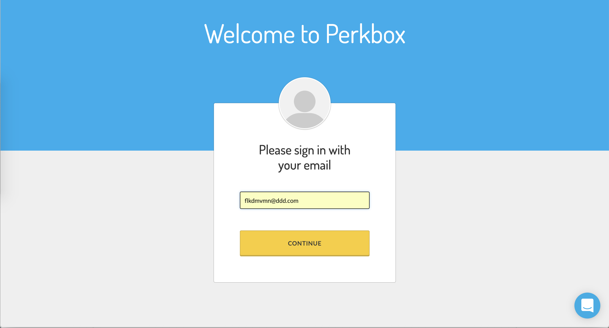
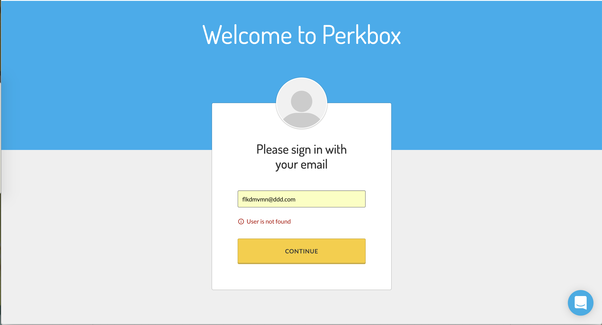
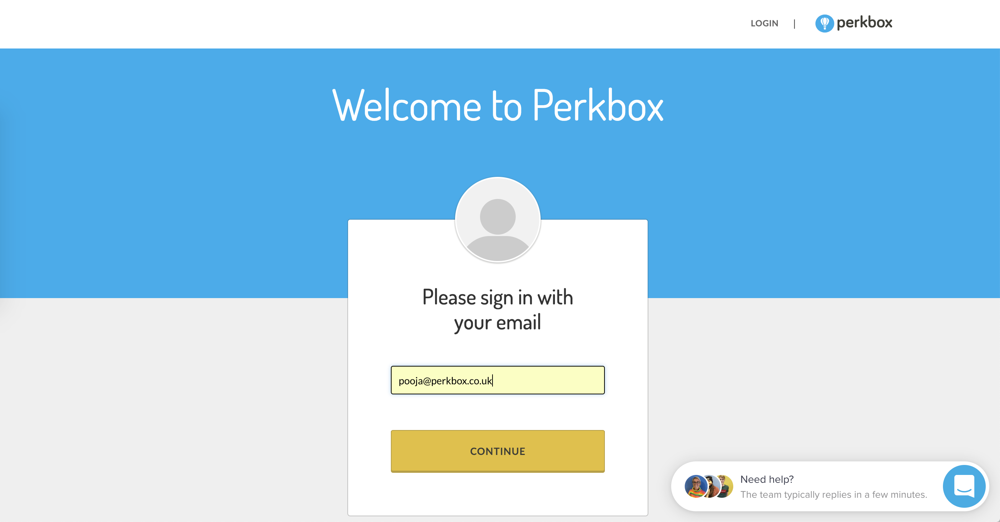
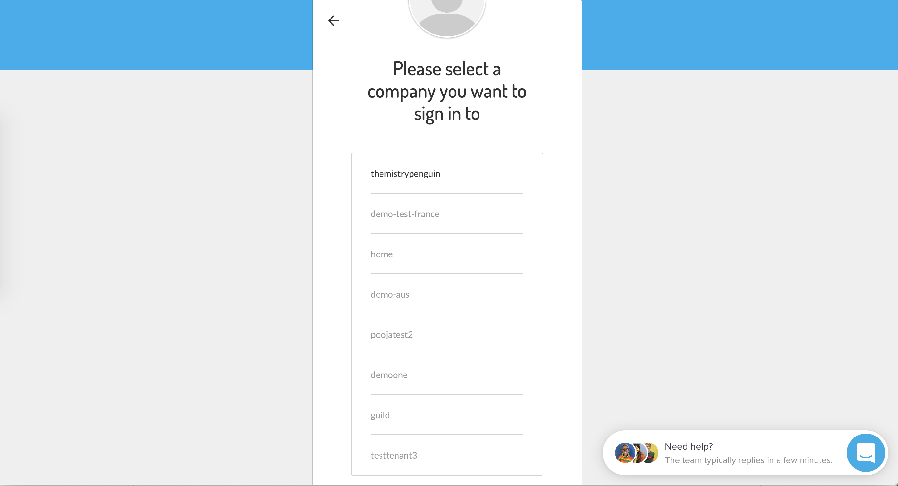
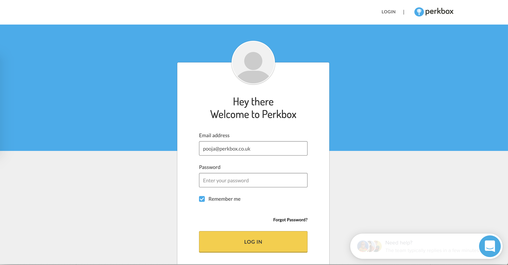

# Multi-account Testing Tech Test

## Notes

I chose [Cypress](https://www.cypress.io/) as a Testing Suite, which uses Javascript. I didn't used Cypress before, but researching about it I thought this framework is the best fit for this project.

Unfortunately, I couldn’t do as many things as I wanted to, because I run out of time.
I spent too much time on writing down all of the test scenarios.
After doing the manual testing, I only had 15 minutes to setup cypress and write the automated tests.

After the time was up ("adds second test" commit) I didn't have a README, and my test scenario file didn't looked as good on github. I realised after uploading that github requires an empty line before tables, otherwise it doesn't render them. Later on I made changes to that file to make it readable. I also had to remove the ".only" keyword and some redundant code from my second test, which I accidentally left in, so both test could run.


## What I could have done better?
- Manage my time better
- my second automated test should be more generic (e.g. selecting account list elements not by id, but as a child of the wrapper element)
- make more dirverse tests
- make more informative commit messages
- be more calm and pay more attention
- include screenshots for manual testing in the file

## Testing scenarios

```text
test-scenarios.md
```

## Manual Testing

```text
manual_testing.md
```
1. Test case



2. Test Case




## Setup

This project requires npm installed.

Install dependencies:
```bash
npm install
```

## Run Tests

```bash
npm run test
```

## Open Testing suite

```bash
./node_modules/.bin/cypress open
```

## Testing Technologies

[Cypress](https://www.cypress.io/)

